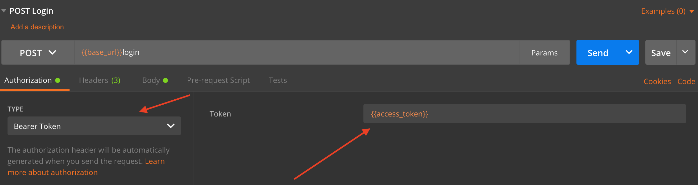

<p align="center"><a href="https://laravel.com" target="_blank"></a></p>

## 💼 &nbsp; About Invoice Service_TH


This take home project is about creating an invoice service that has two main endpoints:

1. ```POST /invoices:``` receives invoice payload, calculates tax and total and then stores the data in the database.
2. ```GET /invoices:``` returns list of invoices and summary (invoice_count, total_invoice_amount)

### 🛠 &nbsp; Installation

This project was built with the popular Laravel Framework with Sanctum package for authentication.

Follow the steps below to have it running on your local system:
Steps:
- clone the repository ```git clone https://github.com/tengine8000/cloudinteractive_invoice_service.git```
- Change directory into the project folder ```cd cloudinteractive_invoice_service/```
- Run ```composer update``` to install al the required packages
- Setup your local ```MySQL``` database
- Add the database connection parameters to your ```.env``` file
- Install the Laravel Sanctum package ```composer require laravel/sanctum```
- Publish Sanctum configuration using ```php artisan vendor:publish --provider="Laravel\Sanctum\SanctumServiceProvider"```
- Run migrations ```php artisan migrate``` to create relevant tables
- Run ```php artisan key:generate``` to generate the secure application keys.

- Now you can start the application with ```php artisan serve```

If you encounter any problems installing the project or you want to learn more about installing Laravel, you can go to the [Laravel Installation Guide](https://laravel.com/docs/8.x/installation).

### ⚙️ &nbsp; Running and Testing with Postman

To test the endpoints, if your server is running on ```http://127.0.0.1:8000``` then navigate to ```http://127.0.0.1:8000/api/``` as the base url for the service.

You will need to **register** at ```http://127.0.0.1:8000/api/register``` and then **login** ```http://127.0.0.1:8000/api/login``` to obtain your **access token** for the invoice service. Otherwise, you will get an **Unauthenticated error message.**

Once you have your access token, use it as your ```Bearer Token``` like in the image below



You can now make authorized requests to 
1. **GET /invoices**, ```http://127.0.0.1:8000/api/invoices```  or 
2. **POST /invoices**, ```http://127.0.0.1:8000/api/invoices```

### Further Information

If you need to learn more about this project, feel free to contact me.

<p align="left">
<a href="https://www.tortyemmanuel.com/"></a>
<a href="https://www.linkedin.com/in/emmanuel-torty-60052153/"></a>
<a href="mailto:torty.emmanuel@gmail.com"></a>
</p>